## Typical example of performance testing for itsyou.online

** Add Test Plane
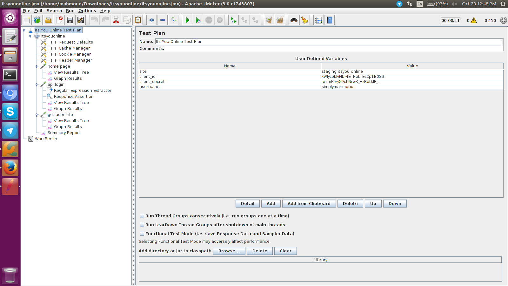

** Add Thread Group
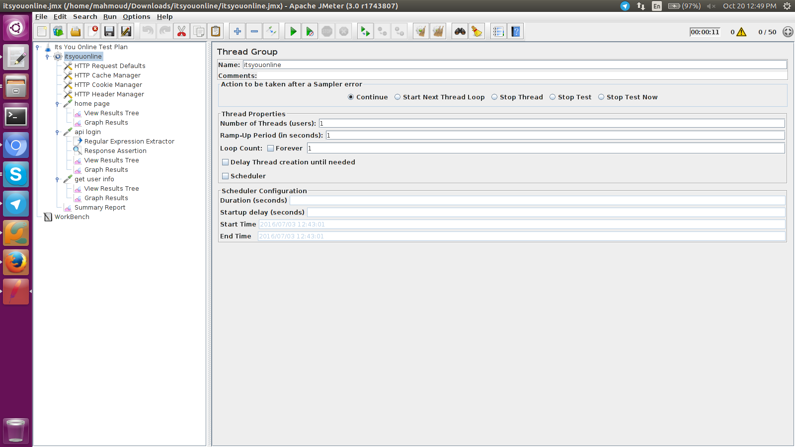

** Add HTTP Request Defaults
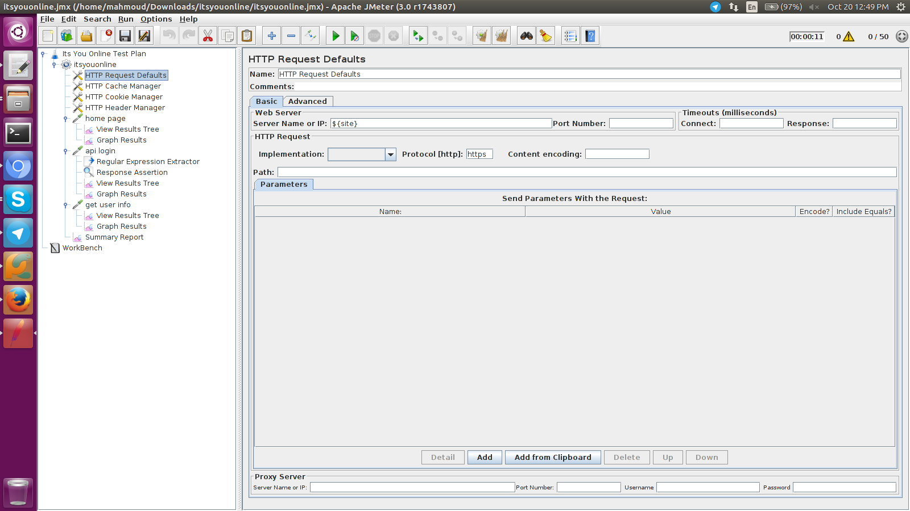

** Add HTTP Cache Manager
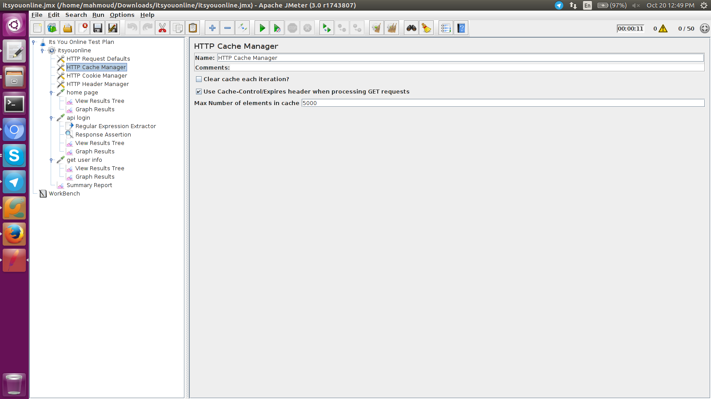

** Add HTTP Cookie Manager
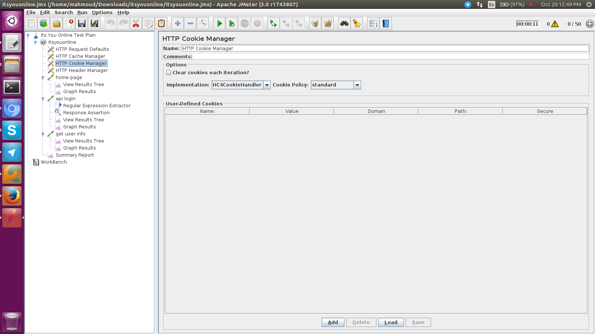

** Add HTTP Header Manager
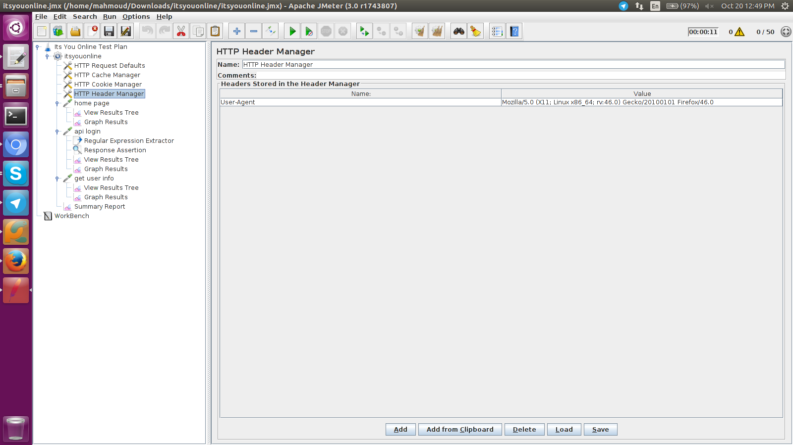

** Add HTTP Request for home page
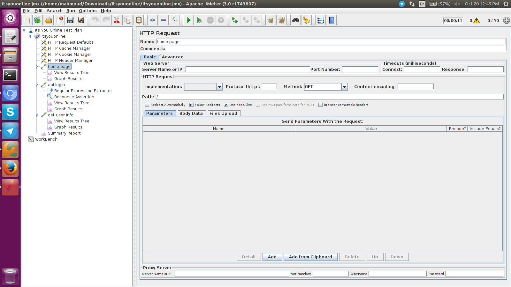

** Add HTTP Request for api login
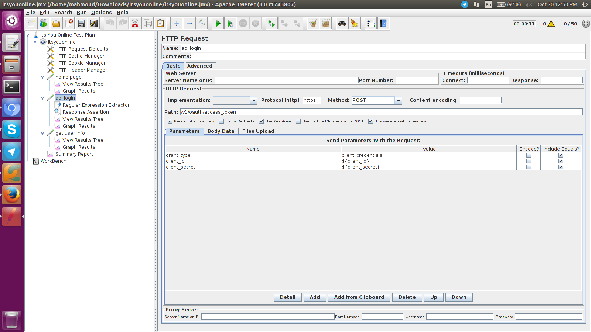

** Add Regular Expression Extractor to get the access token after login
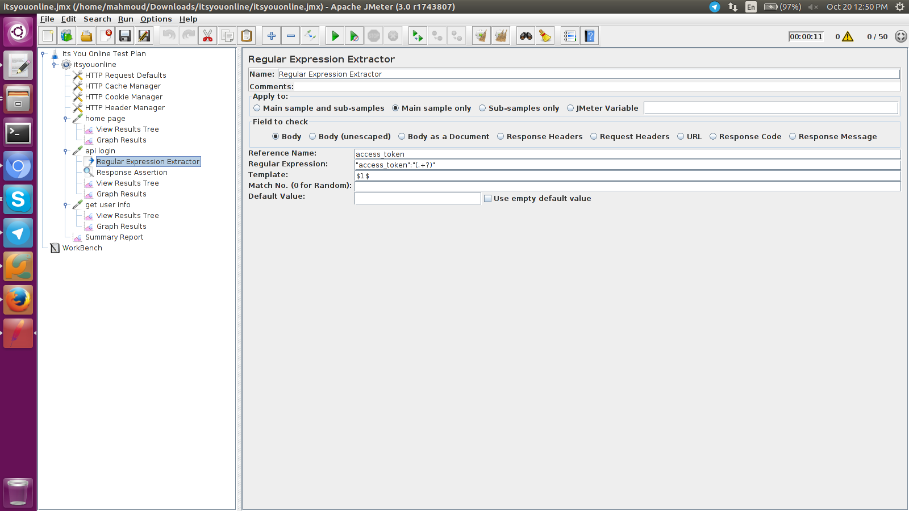

** Add Response Assertion to validate the response
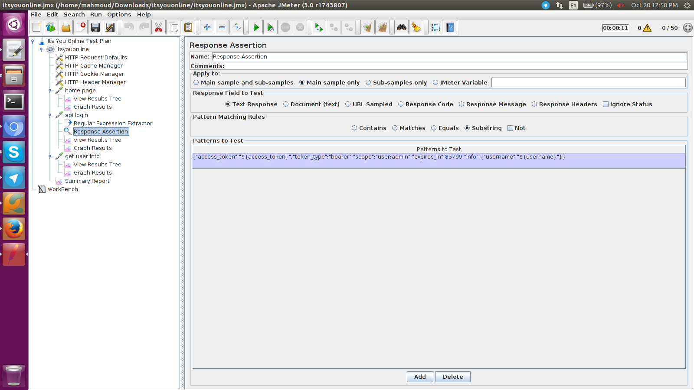

** Add HTTP Request for api call (get info)
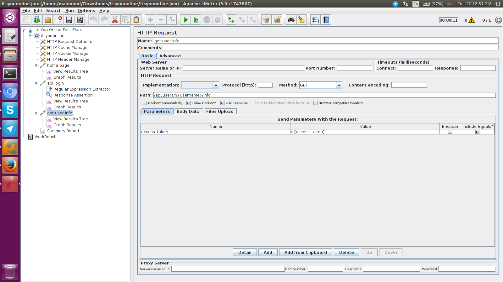

** Download this example from here:
[itsyouonline.jmx](itsyouonline.jmx)
